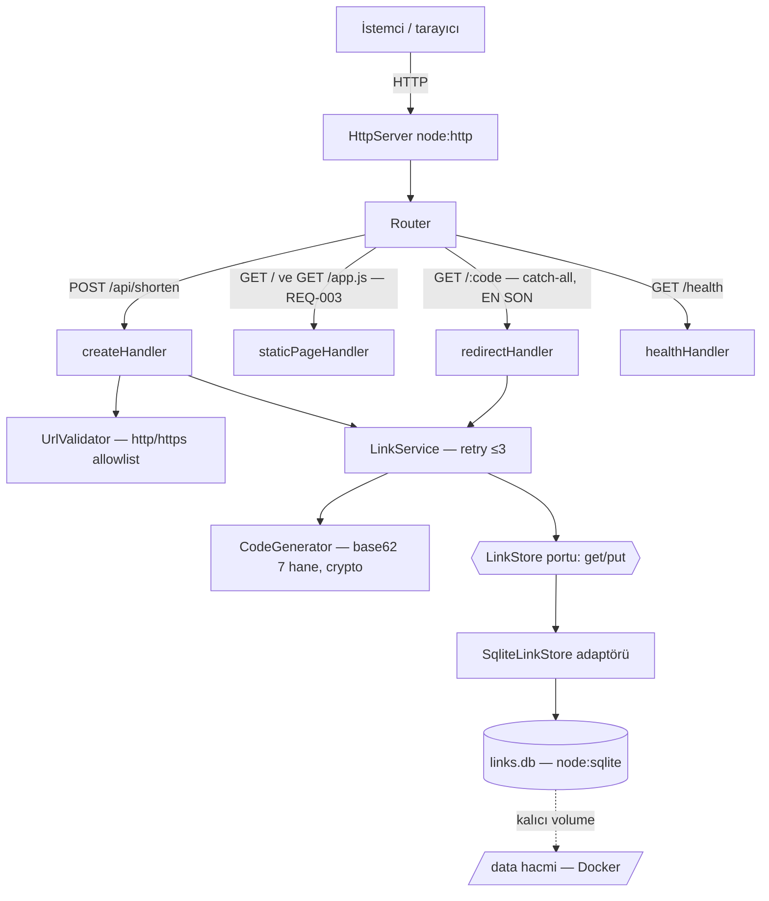
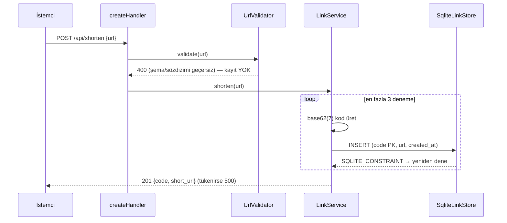
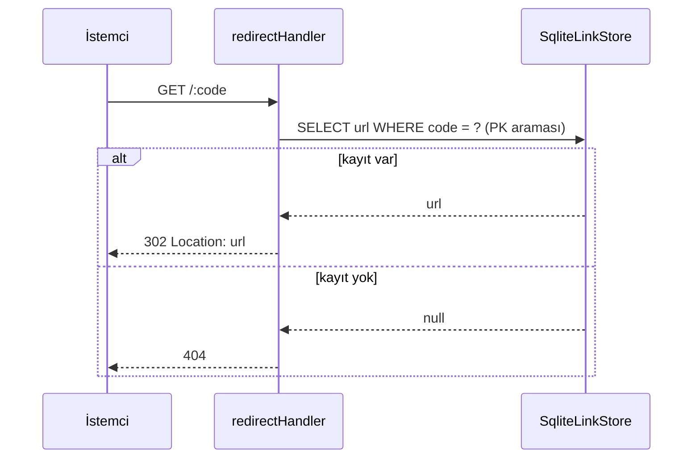
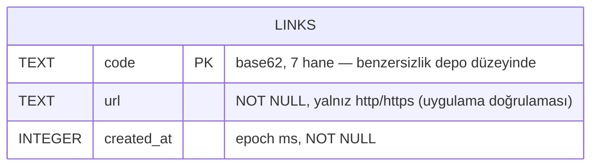

# 05 — Mimari Tasarım: url-shortener

- Tarih: 2026-07-27 | Mod: AUTOPILOT | Profil: LITE
- Girdi: `docs/03-requirements.md`, `docs/04-solution-analysis.md` (seçim: `node:sqlite` + `LinkStore` portu, base62(7) rastgele + PK retry)
- **REQ-003 delta (2026-07-31):** FR-4 için Router'a statik sayfa dalı eklendi (yeni bileşen değil) — bkz. "REQ-003 delta" bölümü + DL-05-004.

## Bileşen görünümü

- **Katman kuralı:** handler → service → port. HTTP tipleri servise, SQL adaptör dışına SIZMAZ (geri alınabilirlik: adaptör değişimi tek dosya).
- `staticPageHandler` (REQ-003) **servise/porta dokunmaz** — sabit yanıt üretir, DB erişimi yok; katman kuralının dışına çıkmaz (yalnız handler katmanı).

## Veri akışı

## Veri modeli

- DDL (boot'ta idempotent): `CREATE TABLE IF NOT EXISTS links (code TEXT PRIMARY KEY, url TEXT NOT NULL, created_at INTEGER NOT NULL);`
- Tek varlık, ilişki yok. Aynı URL birden çok koda sahip olabilir (FR-1: her istek benzersiz kod).
- `journal_mode=WAL`, `synchronous=NORMAL` — commit kalıcılığı + tek yazarlı düşük gecikme.

## Teknoloji seçimleri
| Katman | Seçim | Alternatifler | DL referansı |
|--------|-------|---------------|--------------|
| Uygulama yapısı | Katmanlı modüler monolit + `LinkStore` portu | Tek dosya script; mikroservis | DL-05-001 |
| HTTP | `node:http` (stdlib, framework yok) | Express, Fastify | DL-05-002 |
| Depolama | `node:sqlite` tek dosya (Faz 4 kararı) | Map+snapshot, JSONL | DL-04-001 |
| Kod üretimi | `crypto.randomBytes` → base62(7) (Faz 4) | Monotonik sayaç | DL-04-002 |
| Kalıcılık/paketleme | DB yolu `DB_PATH` env (vars. `/data/links.db`) + Docker **named volume** | İmaj içi yol (veri kaybı) | DL-05-003 |
| Web arayüzü (REQ-003) | `staticPageHandler` + `src/static-page.js` inline HTML/JS dizesi (framework yok) | SPA bundle; diskten statik dosya servisi | DL-04-003, DL-05-004 |
| Test | `node:test` + `:memory:` DB | Jest/Vitest | DL-05-002 |

## NFR ↔ Mimari eşlemesi (kalite kapısı kanıtı)
| NFR | Mimarideki somut karşılığı |
|-----|-----------------------------|
| NFR-1 ≤200ms p95 | Tek süreç, ağ/dış servis çağrısı YOK; okuma = tek PK araması, yazma = tek INSERT (WAL). Sunucu boot'ta hazırlanan prepared statement'lar; süre `node:test` ile ölçülür |
| NFR-2 http/https | `UrlValidator` **kayıt öncesi** kapı: `new URL()` + `['http:','https:']` allowlist → 400; handler zincirinde validator geçilmeden `LinkService` çağrılamaz (tek giriş noktası) |
| NFR-3 %100 doğruluk | Yönlendirme yalnız commit'lenmiş satırdan okunur (bellek önbelleği YOK → bayat/kayıp eşleme imkânsız); bulunamayan kod 404. `:memory:` DB ile uçtan uca entegrasyon testi |
| NFR-4 çakışma 0 | İki katman: `code` **PRIMARY KEY** (depo düzeyi, kod hatasında bile INSERT reddedilir) + 62^7 rastgele uzay; ihlalde ≤3 retry, tükenirse 500 (sessiz üzerine yazma YOK — `INSERT OR REPLACE` yasak) |

## Açık risk (Faz 4'ten devralındı)
- **DB dosyası kalıcılığı:** container yeniden oluşturulunca imaj içi dosya silinir → tüm eşlemeler kaybolur (NFR-3 ihlali). Azaltım mimaride: DB yolu `DB_PATH` env ile dışarı alındı, varsayılan `/data/links.db`; Faz 12 Dockerfile `VOLUME /data` + deploy `-v` bağlaması ZORUNLU kabul edilir. Boot'ta dizin yoksa oluşturulur, yazılamıyorsa süreç **hızlı başarısız** olur (sessizce geçici diske düşmez).
- `node:sqlite` deneysel (Node 22) → adaptör izolasyonu + `--no-warnings` yerine sürüm sabitleme (Faz 12).

## REQ-003 delta (2026-07-31) — FR-4 web arayüzü

**Bu YENİ bir mimari karar değil, mevcut mimarinin küçük bir genişlemesidir:** yeni bileşen/servis/katman,
yeni veri modeli, yeni port/adaptör YOK. Değişen tek şey Router'ın dallanma kümesi.

- **Router genişlemesi:** `createRouter({ shortenHandler, redirectHandler, healthHandler })` imzasına
  `staticPageHandler` eklenir (Faz 9). İki GET dalı: `GET /` → HTML sayfa, `GET /app.js` → sayfanın JS'i.
- **Dal SIRASI kritik (mevcut kod gerçeği):** `router.js`'te "diğer tüm GET" dalı `redirectHandler`'a
  gider; yeni dallar bu catch-all'dan **ÖNCE** yerleşmeli, aksi hâlde `GET /` 404 döner. Sıra:
  `/health` → `POST /api/shorten` → **`/` ve `/app.js`** → catch-all GET (redirect).
- **CSP kısıtı (mevcut karardan doğdu, gevşetme YOK):** `applySecurityHeaders` her yanıta
  `default-src 'none'` uygular; bu inline `<script>`/`<style>` ve `fetch('/api/shorten')` çağrısını
  bloklar. Çözüm mimari, güvenlik gevşetmesi değil: sayfanın JS'i **ayrı bir route'tan** (`GET /app.js`)
  gelir ve bu iki route'a **route'a özgü** CSP verilir:
  `default-src 'none'; script-src 'self'; connect-src 'self'; base-uri 'none'; form-action 'none'`.
  Inline `<style>`/`style=` kullanılmaz (görsel sadelik CSP'ye feda edilir); `'unsafe-inline'` YASAK
  (docs/07-security.md SEC-8). Diğer route'ların başlıkları **değişmez**.
- **Güven sınırı değişmedi:** sayfa yalnız bir istemcidir. NFR-2 doğrulaması (http/https allowlist)
  sunucuda, `UrlValidator`'da kalır; istemci-tarafı kontrol sadece kullanım kolaylığıdır.
- **Sunum güvenliği:** kısaltma sonucu ve hata mesajı DOM'a `textContent` ile yazılır (`innerHTML` YASAK)
  → kullanıcı girdisi üzerinden XSS yolu açılmaz (DL-03-002 riski kapatıldı).
- **Rate limit:** statik dallar `REDIRECT_RATE` bütçesini tüketmez (DB'ye dokunmayan sabit yanıt);
  sayfa açmak yönlendirme kotasını yemez.
- **Erişilebilirlik varsayımı güncellendi:** bu mimari artık kullanıcı-görünür bir HTML yüzeyi içerir;
  `docs/06-uiux/README.md`'deki "Erişilebilirlik: N/A (arayüz yok)" notu **geçersizdir** (Faz 6 deltasında
  düzeltilecek — semantik form etiketleri + klavye erişimi orada tanımlanır). Bu doküman "saf HTTP
  sözleşmesi" varsayımını taşımıyordu, ürün tipi service→web yüzeyi kazanan bir servistir.
- **Veri modeli / paketleme etkisi: SIFIR.** `links` tablosu, `DB_PATH`/volume sözleşmesi ve Dockerfile
  aynı kalır (sayfa kod içinde, kopyalanacak asset yok).

### FR-4 ↔ Mimari eşlemesi (mevcut NFR eşlemesi bozulmadı)
| Gereksinim | Mimarideki somut karşılığı |
|-----|-----------------------------|
| FR-4 kabul kriteri 1 (`GET /` → 200 HTML form) | Router'da catch-all'dan ÖNCEki `/` dalı → `staticPageHandler` sabit yanıt |
| FR-4 kabul kriteri 2 (sonuç aynı sayfada) | `GET /app.js` ile gelen JS `fetch POST /api/shorten` (FR-1 yolu aynen) → `textContent` ile render |
| FR-4 kabul kriteri 3 (hata gösterimi) | 400 yanıtının `message` alanı okunur (mevcut hata sözleşmesi, docs/06) — sayfa çökmez |
| NFR-1 ≤200ms | Statik dallar bellekten sabit yanıt; DB/servis çağrısı YOK → bütçeyi etkilemez |
| NFR-2 http/https | Değişmedi: doğrulama sunucuda `UrlValidator`'da; istemci kontrolü güven sınırı değil |
| NFR-3 / NFR-4 | Dokunulmadı — yönlendirme ve kod üretimi yollarına yeni dal girmiyor |

## ADR listesi
- DL-05-001: Katmanlı modüler monolit + `LinkStore` port/adaptör sınırı
- DL-05-002: HTTP ve test için sıfır bağımlılık (`node:http` + `node:test`)
- DL-05-003: DB yolu env ile dışarı alınır + kalıcı volume zorunluluğu
- DL-05-004: REQ-003 — Router'a `staticPageHandler` dalı + route'a özgü CSP (mevcut mimarinin genişlemesi)

## Kalite kapısı raporu
- "Kritik NFR'lerin mimaride karşılığı var" → ✅ NFR-1..4'ün DÖRDÜ de eşleme tablosunda somut bileşene bağlandı (validator kapısı, PK+retry, önbeleksiz okuma, tek-süreç PK araması)
- Faz 4 açık riski (kalıcı volume) → ✅ ele alındı (Açık risk bölümü + teknoloji tablosu + DL-05-003)
- REQ-003 deltası → ✅ FR-4'ün üç kabul kriteri de mimari karşılığına bağlandı; NFR-1..4 eşlemesi **bozulmadı** (statik dal DB'ye dokunmaz, doğrulama sunucuda kalır); CSP kısıtı gevşetmeden çözüldü
- Decision Log → ✅ DL-05-001, DL-05-002, DL-05-003, DL-05-004
