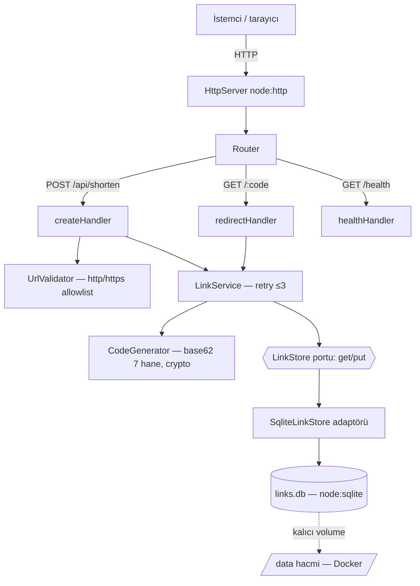
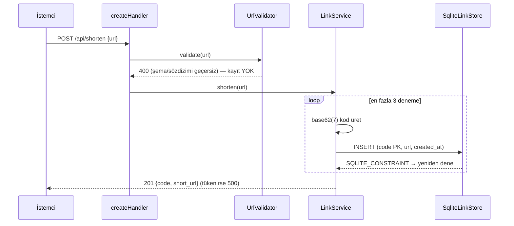
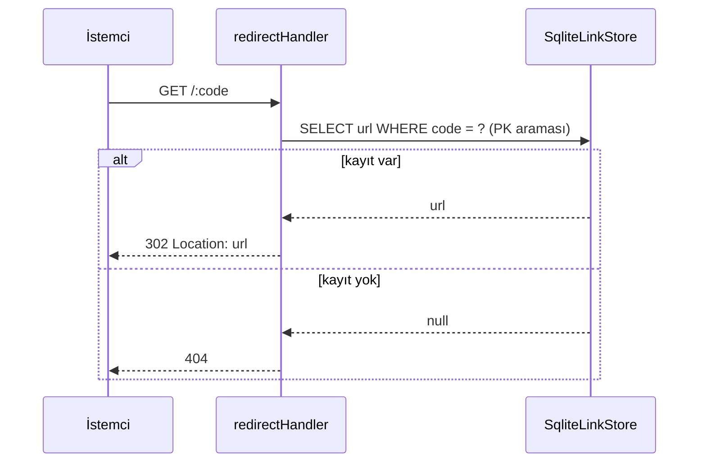
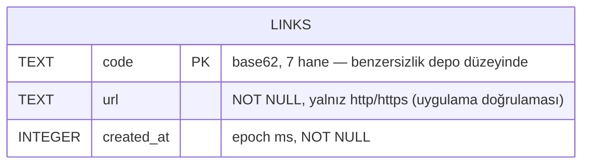

# 05 — Mimari Tasarım: url-shortener

- Tarih: 2026-07-27 | Mod: AUTOPILOT | Profil: LITE
- Girdi: `docs/03-requirements.md`, `docs/04-solution-analysis.md` (seçim: `node:sqlite` + `LinkStore` portu, base62(7) rastgele + PK retry)

## Bileşen görünümü

- **Katman kuralı:** handler → service → port. HTTP tipleri servise, SQL adaptör dışına SIZMAZ (geri alınabilirlik: adaptör değişimi tek dosya).

## Veri akışı

## Veri modeli

- DDL (boot'ta idempotent): `CREATE TABLE IF NOT EXISTS links (code TEXT PRIMARY KEY, url TEXT NOT NULL, created_at INTEGER NOT NULL);`
- Tek varlık, ilişki yok. Aynı URL birden çok koda sahip olabilir (FR-1: her istek benzersiz kod).
- `journal_mode=WAL`, `synchronous=NORMAL` — commit kalıcılığı + tek yazarlı düşük gecikme.

## Teknoloji seçimleri
| Katman | Seçim | Alternatifler | DL referansı |
|--------|-------|---------------|--------------|
| Uygulama yapısı | Katmanlı modüler monolit + `LinkStore` portu | Tek dosya script; mikroservis | DL-05-001 |
| HTTP | `node:http` (stdlib, framework yok) | Express, Fastify | DL-05-002 |
| Depolama | `node:sqlite` tek dosya (Faz 4 kararı) | Map+snapshot, JSONL | DL-04-001 |
| Kod üretimi | `crypto.randomBytes` → base62(7) (Faz 4) | Monotonik sayaç | DL-04-002 |
| Kalıcılık/paketleme | DB yolu `DB_PATH` env (vars. `/data/links.db`) + Docker **named volume** | İmaj içi yol (veri kaybı) | DL-05-003 |
| Test | `node:test` + `:memory:` DB | Jest/Vitest | DL-05-002 |

## NFR ↔ Mimari eşlemesi (kalite kapısı kanıtı)
| NFR | Mimarideki somut karşılığı |
|-----|-----------------------------|
| NFR-1 ≤200ms p95 | Tek süreç, ağ/dış servis çağrısı YOK; okuma = tek PK araması, yazma = tek INSERT (WAL). Sunucu boot'ta hazırlanan prepared statement'lar; süre `node:test` ile ölçülür |
| NFR-2 http/https | `UrlValidator` **kayıt öncesi** kapı: `new URL()` + `['http:','https:']` allowlist → 400; handler zincirinde validator geçilmeden `LinkService` çağrılamaz (tek giriş noktası) |
| NFR-3 %100 doğruluk | Yönlendirme yalnız commit'lenmiş satırdan okunur (bellek önbelleği YOK → bayat/kayıp eşleme imkânsız); bulunamayan kod 404. `:memory:` DB ile uçtan uca entegrasyon testi |
| NFR-4 çakışma 0 | İki katman: `code` **PRIMARY KEY** (depo düzeyi, kod hatasında bile INSERT reddedilir) + 62^7 rastgele uzay; ihlalde ≤3 retry, tükenirse 500 (sessiz üzerine yazma YOK — `INSERT OR REPLACE` yasak) |

## Açık risk (Faz 4'ten devralındı)
- **DB dosyası kalıcılığı:** container yeniden oluşturulunca imaj içi dosya silinir → tüm eşlemeler kaybolur (NFR-3 ihlali). Azaltım mimaride: DB yolu `DB_PATH` env ile dışarı alındı, varsayılan `/data/links.db`; Faz 12 Dockerfile `VOLUME /data` + deploy `-v` bağlaması ZORUNLU kabul edilir. Boot'ta dizin yoksa oluşturulur, yazılamıyorsa süreç **hızlı başarısız** olur (sessizce geçici diske düşmez).
- `node:sqlite` deneysel (Node 22) → adaptör izolasyonu + `--no-warnings` yerine sürüm sabitleme (Faz 12).

## ADR listesi
- DL-05-001: Katmanlı modüler monolit + `LinkStore` port/adaptör sınırı
- DL-05-002: HTTP ve test için sıfır bağımlılık (`node:http` + `node:test`)
- DL-05-003: DB yolu env ile dışarı alınır + kalıcı volume zorunluluğu

## Kalite kapısı raporu
- "Kritik NFR'lerin mimaride karşılığı var" → ✅ NFR-1..4'ün DÖRDÜ de eşleme tablosunda somut bileşene bağlandı (validator kapısı, PK+retry, önbeleksiz okuma, tek-süreç PK araması)
- Faz 4 açık riski (kalıcı volume) → ✅ ele alındı (Açık risk bölümü + teknoloji tablosu + DL-05-003)
- Decision Log → ✅ DL-05-001, DL-05-002, DL-05-003
