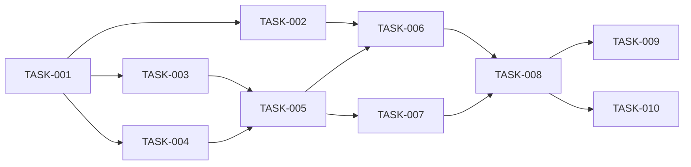

# 08 — Planlama: url-shortener

- Tarih: 2026-07-27 | Mod: AUTOPILOT | Profil: LITE
- **REQ-003 delta (2026-07-31):** M2 + TASK-010 eklendi (FR-4 web arayüzü).

> LITE: milestone + önceliklendirilmiş backlog (sprint kırılımı yok).

## Milestone'lar
| M | Hedef | Kapsanan FR'ler | Hedef tarih |
|---|-------|-----------------|-------------|
| M1 | Çalışan url-shortener servisi (kısalt+yönlendir+doğrula) | FR-1, FR-2, FR-3 | 2026-07-28 |
| M2 | Web arayüzü (REQ-003) | FR-4 | 2026-07-31 |

## Backlog (önceliklendirilmiş, GitHub Issues formatına uyumlu)

### [M1] TASK-001: Proje iskeleti + LinkStore port arayüzü
- **Tahmin:** 0.5 gün
- **Bağımlılık:** —
- **FR:** FR-1 (temel)
- **Kabul:** `src/` dizin yapısı kurulu; `LinkStore` port tipi (`get(code)`, `put(code,url)`) tanımlı; boş `node:test` iskeleti çalışıyor.

### [M1] TASK-002: UrlValidator (http/https allowlist)
- **Tahmin:** 0.5 gün
- **Bağımlılık:** TASK-001
- **FR:** FR-3
- **Kabul:** Geçersiz şema/sözdizimi → red; test: `new URL()` + allowlist %100 red (NFR-2).

### [M1] TASK-003: CodeGenerator (base62 7 hane, crypto)
- **Tahmin:** 0.5 gün
- **Bağımlılık:** TASK-001
- **FR:** FR-1
- **Kabul:** 7 haneli base62 kod üretir; test: karakter kümesi + uzunluk doğrulanır.

### [M1] TASK-004: SqliteLinkStore adaptörü (DDL, WAL, get/put)
- **Tahmin:** 1 gün
- **Bağımlılık:** TASK-001
- **FR:** FR-1, FR-2
- **Kabul:** `CREATE TABLE IF NOT EXISTS` idempotent; PK ihlali `SQLITE_CONSTRAINT` fırlatır; `:memory:` ile test edilir (NFR-4).

### [M1] TASK-005: LinkService (shorten + retry ≤3, lookup)
- **Tahmin:** 0.5 gün
- **Bağımlılık:** TASK-003, TASK-004
- **FR:** FR-1
- **Kabul:** Çakışmada ≤3 retry; tükenirse hata; test: çakışma simülasyonu (NFR-1, NFR-4).

### [M1] TASK-006: createHandler (POST /api/shorten)
- **Tahmin:** 0.5 gün
- **Bağımlılık:** TASK-002, TASK-005
- **FR:** FR-1, FR-3
- **Kabul:** Geçersiz URL → 400, kayıt yok; geçerli URL → 201 + code/short_url ≤200ms.

### [M1] TASK-007: redirectHandler (GET /:code)
- **Tahmin:** 0.5 gün
- **Bağımlılık:** TASK-005
- **FR:** FR-2
- **Kabul:** Kayıtlı kod → 302 doğru hedefe; bilinmeyen kod → 404.

### [M1] TASK-008: HTTP server + router + healthHandler
- **Tahmin:** 0.5 gün
- **Bağımlılık:** TASK-006, TASK-007
- **FR:** FR-1, FR-2
- **Kabul:** `node:http` sunucu ayakta, route'lar bağlı, `/health` 200 döner.

### [M1] TASK-009: Uçtan uca entegrasyon testleri (:memory: DB)
- **Tahmin:** 0.5 gün
- **Bağımlılık:** TASK-008
- **FR:** FR-1, FR-2, FR-3
- **Kabul:** Kısalt→yönlendir→404 senaryoları %100 geçer (NFR-1..4 kapsanır).

### [M2] TASK-010: staticPageHandler (GET / + GET /app.js) — REQ-003
- **Tahmin:** 0.5 gün
- **Bağımlılık:** TASK-008
- **FR:** FR-4
- **Kabul:** `GET /` 200 + form HTML; `GET /app.js` 200 + script; route'lar catch-all redirect'ten ÖNCE (DL-05-004); sonuç/hata `textContent` ile (DL-06-002/Faz 7); mevcut `GET /:code` 404 davranışı bozulmadı (regresyon testi).

## Bağımlılık grafı (kalite kapısı: çevrimsiz)

## Kalite kapısı raporu
- "Her task 1 günden küçük" → ✅ (en uzun TASK-004 = 1 gün, diğerleri ≤0.5 gün, TASK-010 = 0.5 gün)
- "Bağımlılık grafı çevrimsiz" → ✅ (DAG: 001→{002,003,004}→005→{006,007}→008→{009,010}, geri kenar yok)
